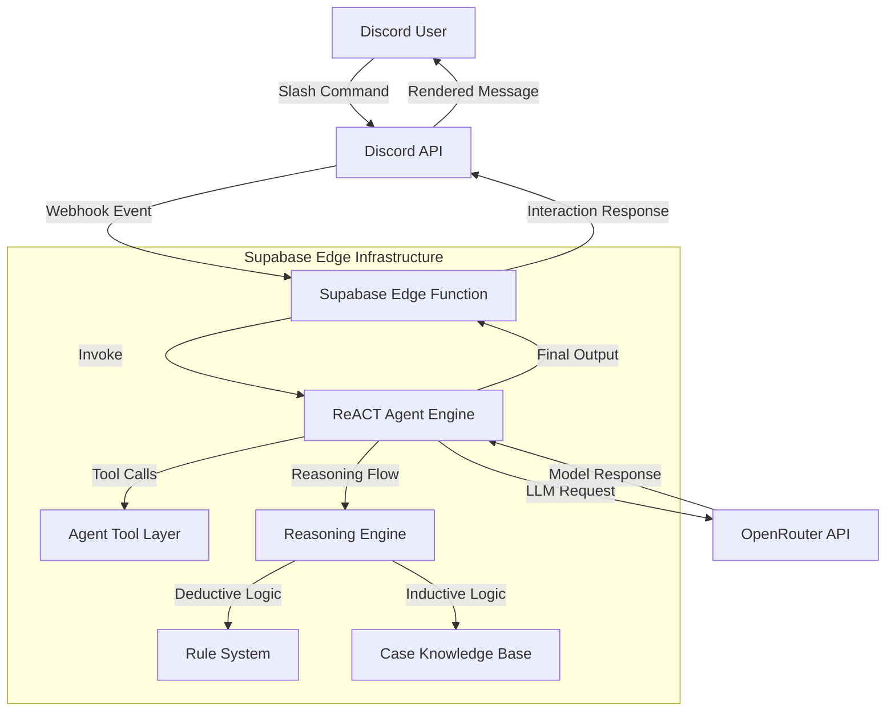
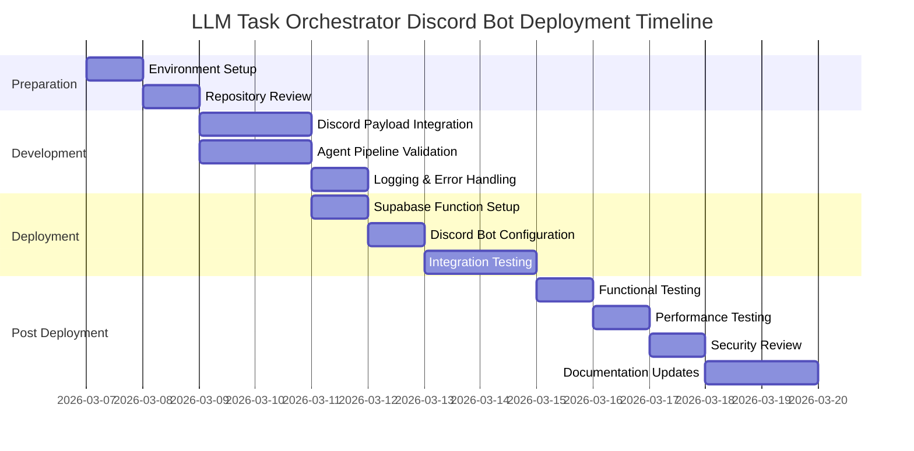

# 🤖 Discord Bot Deployment Plan — LLM Task Orchestrator

**File Location:**
`LLM-Task-Orchestrator/chat_integrations/plans/discord_bot_deployment_plan.md`

---

## 1. Project Overview

The **LLM Task Orchestrator Discord Bot** is a production-ready Discord integration that exposes a **ReACT (Reasoning + Acting) autonomous agent** through Discord slash commands. The bot leverages the **OpenRouter API** for large language model inference and executes tool-driven reasoning workflows inside **Supabase Edge Functions**.

This architecture enables:

* Serverless global deployment
* Secure Discord interaction handling
* Autonomous tool execution
* Domain-aware reasoning pipelines
* Low-latency edge responses

The bot acts as a real-time interface between Discord users and the LLM Task Orchestrator agent engine.

---

## 🏗 System Architecture

### High-Level Data Flow



---

## 2. Preparation Phase

---

### 2.1 Environment Setup

Before deployment, ensure the following prerequisites are met:

* Supabase CLI installed and authenticated
* Active Supabase project
* OpenRouter API key available
* Discord Developer account created
* Discord application and bot registered
* Node.js installed (for Supabase CLI tooling)

---

### 2.2 Repository Structure Validation

Confirm the following directory exists:

```
LLM-Task-Orchestrator/chat_integrations/
```

Verify:

* agent.ts exists
* scripts folder present
* verification scripts available
* plans folder available
* no hardcoded secrets in source code

---

## 3. Development Tasks

---

### 3.1 Discord Interaction Integration

Modify the HTTP handler inside `agent.ts` to:

* Accept Discord interaction payloads
* Parse slash command parameters
* Return properly formatted interaction responses
* Handle Discord ping verification

---

### Required Implementation Changes

* Parse Discord interaction JSON payload
* Detect interaction type
* Extract command arguments
* Format response using Discord's API schema

---

### 3.2 Agent Execution Pipeline

Validate:

* ReACT loop initialization
* Tool registration
* Reasoning engine integration
* Prompt pipeline correctness
* OpenRouter API connectivity

---

### 3.3 Logging & Error Handling

Add structured logging for:

* Request lifecycle
* Tool execution
* LLM responses
* Error scenarios

Implement fallback responses for:

* API failures
* Tool errors
* Timeout conditions
* Invalid input formats

---

## 4. Deployment Process

---

### 4.1 Supabase Edge Function Setup

---

#### Create New Edge Function

```bash
supabase functions new llm-discord-bot
```

---

#### Configure Environment Secrets

Set OpenRouter API key:

```bash
supabase secrets set OPENROUTER_API_KEY=your_key
```

Optional:

```bash
supabase secrets set LOG_LEVEL=info
```

---

#### Deploy Edge Function

```bash
supabase functions deploy llm-discord-bot --no-verify-jwt
```

Deployment will return:

```
https://PROJECT_ID.functions.supabase.co/llm-discord-bot
```

This becomes the Discord interaction endpoint.

---

### 4.2 Discord Bot Configuration

---

#### Register Slash Commands

Inside Discord Developer Portal:

* Create new slash commands
* Define parameters
* Set required permissions

---

#### Configure Interaction Endpoint

Paste Supabase Edge Function URL into:

```
Discord Developer Portal → General Information → Interaction Endpoint URL
```

Discord will perform automatic verification.

---

#### Set Required Bot Permissions

Recommended permissions:

* Send Messages
* Read Message History
* Use Application Commands

---

### 4.3 Integration Testing Phase

Test:

* Slash command invocation
* Agent execution response
* Tool usage scenarios
* Error handling behavior
* Rate limiting behavior

---

## 5. Testing and Verification Strategy

---

### 5.1 Functional Testing

Validate:

* Basic conversational queries
* Tool-driven requests
* Reasoning-based answers
* Domain-specific agent workflows

---

### 5.2 Performance Testing

Measure:

* Average response latency
* Cold start delays
* Peak request handling
* Edge execution time limits

---

### 5.3 Security Validation

Verify:

* Secrets are not logged
* Discord signature validation enabled
* Input sanitization applied
* Request spoofing prevented

---

## 6. Maintenance & Monitoring

---

### 6.1 Observability Setup

Configure:

* Supabase function logs
* Error alerting
* Execution metrics
* Usage analytics

---

### 6.2 Update Strategy

Define procedures for:

* Agent logic updates
* Prompt improvements
* Tool upgrades
* Dependency patching
* Hotfix rollouts

---

### 6.3 Documentation Maintenance

Maintain:

* Deployment documentation
* Troubleshooting guides
* Slash command reference
* Operator runbooks

---

## 7. Deployment Timeline

---

### Execution Roadmap



---

## 8. Detailed Implementation Guide

---

### 8.1 Discord Interaction Handler Implementation

Modify `agent.ts`:

```ts
serve(async (req: Request) => {
  if (req.method !== "POST") {
    return new Response("Method Not Allowed", { status: 405 });
  }

  const data = await req.json();

  // Extract slash command input
  const query = data?.data?.options?.[0]?.value;

  if (!query) {
    return new Response(JSON.stringify({
      type: 4,
      data: { content: "No query provided." }
    }), {
      headers: { "Content-Type": "application/json" }
    });
  }

  try {
    const answer = await runAgent(query);

    return new Response(JSON.stringify({
      type: 4,
      data: { content: answer }
    }), {
      headers: { "Content-Type": "application/json" }
    });

  } catch (err) {

    console.error("Agent execution error:", err);

    return new Response(JSON.stringify({
      type: 4,
      data: { content: "Agent error: " + (err as Error).message }
    }), {
      headers: { "Content-Type": "application/json" }
    });
  }
});
```

---

### 8.2 Discord Request Verification

For production security, validate request signatures:

```ts
const signature = req.headers.get("x-signature-ed25519");
const timestamp = req.headers.get("x-signature-timestamp");

// Apply verification logic here
```

This prevents:

* Replay attacks
* Request spoofing
* Unauthorized access

---

### 8.3 Supabase Deployment Steps

---

#### Create Edge Function

```bash
supabase functions new discord-agent-bot
```

---

#### Copy Agent Entry File

```bash
cp agent.ts .supabase/functions/discord-agent-bot/index.ts
```

---

#### Configure Secrets

```bash
supabase secrets set OPENROUTER_API_KEY=your_key
```

---

#### Deploy Function

```bash
supabase functions deploy discord-agent-bot --no-verify-jwt
```

---

### 8.4 Discord Bot Setup

Complete the following steps:

1. Create Discord application
2. Add bot user
3. Enable Message Content Intent
4. Create slash commands
5. Set Interaction Endpoint URL
6. Generate OAuth invite link
7. Invite bot to server

---

## 9. Risk Assessment & Mitigation

---

### Cold Start Latency

**Risk:** Edge cold starts may introduce delay

**Mitigation:**

* Optimize imports
* Reduce bundle size
* Use lightweight LLM models

---

### Rate Limiting

**Risk:** Discord and OpenRouter impose API limits

**Mitigation:**

* Implement throttling
* Add retry logic
* Queue requests when needed

---

### Token Usage Cost

**Risk:** High LLM usage cost

**Mitigation:**

* Monitor token usage
* Limit response length
* Apply per-user quotas

---

### Error Propagation

**Risk:** Multiple failure points

**Mitigation:**

* Centralized error handling
* Graceful fallback messages
* Alerting on critical failures

---

## ✅ Final Summary

This deployment plan enables **LLM Task Orchestrator** to operate as a fully serverless, scalable, and production-grade Discord bot.

By combining:

* Supabase Edge Functions
* Discord Interactions API
* ReACT autonomous agents
* OpenRouter-powered inference

You achieve:

* Global low-latency execution
* Secure request handling
* Scalable AI automation
* Real-time Discord interaction

This architecture ensures maintainability, extensibility, and operational reliability for long-term production use.

